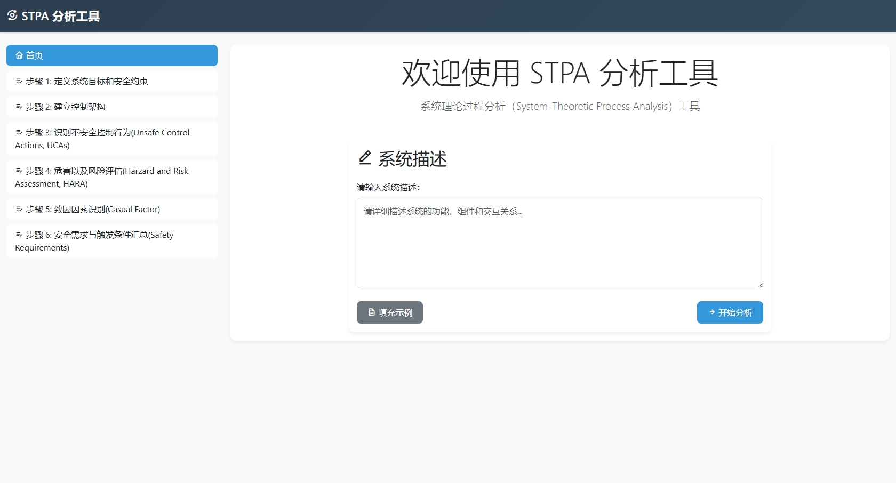
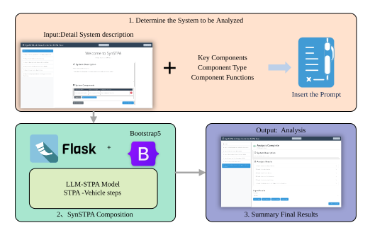

# LLM-STPA: A new form of STPA analysis tool

# Introduction

This is a new form of STPA analysis tool based on LLM. The main idea is to use LLM (Large Language Model) to generate the hazard identification and risk assessment results.
The main architecture is shown in the figure.

# To be updated 
Open stpa.py and run.
	
